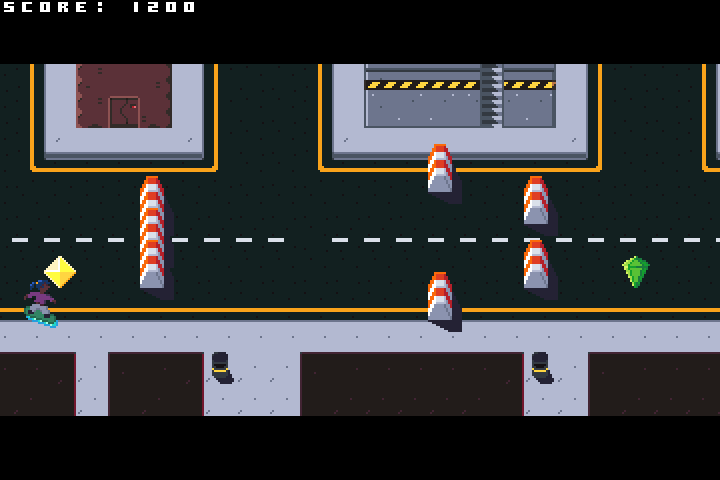

# Catch Them All (temporary name)



An endless runner: avoid obstacles, catch shiny things.

## Dependencies

- libsdl2
- cmake

## Building

```
git submodule update --init
mkdir build
cd build
cmake -DCMAKE_INSTALL_PREFIX=$HOME/.local ..
make
make install
```

Start the game with `ctall` (assuming `$HOME/.local/bin` is in $PATH).
